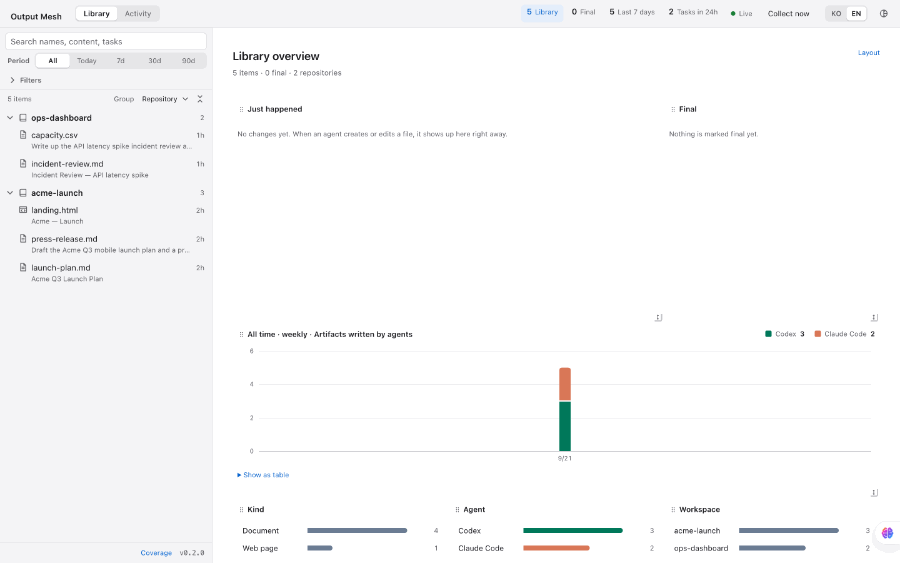

<p align="center">
  🇰🇷 <a href="./README.ko.md">한국어</a> | 🇺🇸 English
</p>

<h1 align="center">output-mesh</h1>

<p align="center">
  A local catalog of the files that your AI agents make.<br />
  Find an artifact in seconds, preview it safely, and see the agent and the session that wrote it.
</p>

<p align="center">
  <a href="./LICENSE"></a>
  <a href="https://bun.sh">= 1.3" /></a>
  
  
</p>

## Why

Agents write reports, PRDs, spreadsheets, HTML prototypes, and images into session folders and repositories. A week later, you remember the task, but not the file name or the location. Many files also have the same name, for example `README.md` or `SKILL.md`.

output-mesh reads those locations **and never changes them**. It puts the files into one library. You can search by file name, by body text, and by the task that made the file. Each file shows the agent, the session, and the repository that it came from.

<p align="center">
  
</p>

<p align="center"><sub>The recording uses isolated sample data, not real logs.</sub></p>

## Quick start

You need macOS and [Bun](https://bun.sh) 1.3 or later. You do not need to install output-mesh:

```bash
bunx output-mesh
```

Then open http://127.0.0.1:19843.

Bun keeps the downloaded package, so the next start is fast. To get a new release, run `bunx output-mesh@latest`. To get the latest commit on `main`, run `bunx github:x-mesh/output-mesh`.

The first run reads all agent logs once and shows the progress. Later starts read only the changes.

The interface is in English and Korean, and it follows your browser language. To change the language, click `KO` or `EN` in the top bar. The startup screen and the command help are in English.

`npx` does not work, because output-mesh uses the SQLite module that is part of Bun. To run output-mesh from a checkout:

```bash
git clone https://github.com/x-mesh/output-mesh.git
cd output-mesh
bun bin/output-mesh.mjs
```

### Run it as a service

To keep output-mesh on after you log in, install it as a service:

```bash
bun install -g output-mesh
output-mesh install
```

On macOS, `install` adds a LaunchAgent. On Linux, it adds a systemd user unit. Use `output-mesh start`, `stop`, `restart`, and `status` to control the service. Use `output-mesh uninstall` to remove it.

`install` does not accept a `bunx` copy, because that temporary path is gone after a restart. You can also run `bun bin/output-mesh.mjs install` from a checkout.

## What it collects

| Source | Location | Method |
|---|---|---|
| Aside | `~/.aside/u/<account>/sessions/<date>_<id>/artifacts/` | Watches the folder. Reads more data from Aside's `state.db` in read-only mode |
| Codex | `~/.codex/sessions/**/rollout-*.jsonl` | Paths from the `apply_patch` markers in session logs |
| Claude Code | `~/.claude/projects/**/*.jsonl` and the session scratch folders in `/private/tmp/claude-<uid>/` | The `file_path` of `Write` and `Edit` tool calls, and the images in the scratch folders |
| Claude Desktop | `~/Library/Application Support/Claude/Cache/Cache_Data/` | Artifact HTML, files that chats wrote, and chat widgets from the local cache |
| Gemini Antigravity | `~/.gemini/{antigravity,antigravity-cli,antigravity-ide}/brain/` | Local session artifacts and the paths from write tool calls |
| Cursor | `~/Library/Application Support/Cursor/.../state.vscdb` | Files that a composer changed or created. Opens the database in read-only mode |
| Your repositories | The repositories that the agents above worked in, and the git worktrees of those repositories | Documents that changed in the last 7 days. After that, a folder watch finds new and changed documents |
| Other files | A folder or a file that you select | `output-mesh import <path>` |

Codex and Claude Code do not keep artifacts in a special folder. But their logs record the paths that they wrote. output-mesh adds the agent and the session to the files that are still in your repositories. The files stay where they are.

The library shows documents, web pages, images, spreadsheets, and project folders. output-mesh also collects source code, agent notes, and other formats, but the library hides them. Agent notes are the memory files that Claude Code keeps in `~/.claude/projects/*/memory/`. To see a hidden kind, select it in the Kind filter. The "Recent changes" feed hides the same kinds and shows how many it hid.

Claude Desktop collection reads only the local Chromium HTTP cache. It does not call private Claude APIs or sync WebSockets. It collects three types of content:

- Artifact HTML that Claude Desktop showed.
- Files that a chat wrote to `/mnt/user-data/outputs/`. A downloaded file keeps its exact bytes. A file that output-mesh rebuilds from the conversation does not include changes from shell commands.
- Chat widgets. output-mesh saves each widget as an HTML page.

The cache keeps only the conversations that you opened in Claude Desktop. output-mesh keeps a copy of each file that it collects, so the file stays in the catalog after the cache deletes it. If Claude Desktop changes its private cache format, this source can stop.

Gemini collection reads only local data from Antigravity, Antigravity CLI, and Antigravity IDE. It collects session artifacts and the current files that `write_to_file` or `replace_file_content` changed. It does not collect scratch files, uploads, generated internal files, metadata, `.resolved` revisions, backups, Gemini web Canvas, or downloaded images. It does not read Gemini account files or send requests to Gemini services. If a repository file no longer exists, output-mesh does not collect it.

Some lines in Antigravity transcripts are not valid JSON. output-mesh skips each of these lines and records one warning for it. A warning is not a collection error.

output-mesh counts a git worktree as part of its main repository. The tree shows each worktree as a `⑂ name` group below that repository. If an agent worked in a repository, output-mesh also watches all worktrees of that repository. When it reads a worktree for the first time, it collects only the documents that changed after git created the worktree. The other files are copies from the checkout. From the temporary session folders of Claude Code (`/private/tmp/claude-*/`), output-mesh collects only images, for example screenshots that an agent took with a script. Other files there are work notes and logs, so output-mesh does not collect them. A scratch image shows a "temporary" mark next to its location. output-mesh does not copy these images. When Claude Code or a restart deletes the folder, the images leave the library. The "Recent changes" feed shows one line for a set of images from one session. By default, output-mesh hides these images. To show them in the list and the feed, click **Temporary images** at the end of the filter row. That switch shows how many images are hidden, and so does the overview header. A click on either count shows them. The Activity view always shows these images.

## How to use it

### Explorer (left)

The explorer has a search box, a period selector (all, today, 7, 30, or 90 days), a Filters button, and a tree.

- **Filters.** The filter panel opens above the preview, so the tree does not move. Each value that you select stays as a token next to the button. Click `×` on a token to remove that value.
- **More than one value.** You can select more than one value in a group, for example Codex and Claude Code. A file matches a group if it matches one of the values. A file must match all groups.
- **Groups.** You can group the tree by repository, agent, app, date, or kind. When you group by agent, each product is below its vendor, for example Claude Code and Claude Desktop below Claude.
- **Logos.** Each folder shows the logos of the agents that made its files.
- **Subtitles.** Each file shows the title of the document. If the title is too general, for example "README" or "Product", the file shows the task that made it.
- **Large folders.** If an agent makes a full project in its artifact folder, the tree shows that project as one row. Click the row to see its files.
- **Menu.** Right-click a row or press `Shift+F10` to open its menu: Final, Favorite, Show in Finder, and Copy path.

If you type a search term, the tree changes to a flat list in relevance order. Each result shows its location and the text that matched. When you open a result, the preview highlights each match and goes to the first match.

### Overview (right, no file selected)

The overview is a grid of widgets. By default, it shows Recent changes, Final, the activity chart, and the breakdowns by kind, agent, and workspace. If you show temporary images, a Temporary images widget also shows small previews of them, grouped by session. You can also turn on Recent tasks, Collection status, Favorites, and Tags.

- To move a widget, drag its handle. To change its size, drag its bottom-right corner.
- Click **Layout** to turn widgets on or off, move them, or restore the default layout. This panel also works with the keyboard.

Recent changes lists each file that an agent created, changed, moved, or removed. Scroll down to see changes from the last 30 days. If output-mesh finds a change more than four hours after the agent made it, the feed does not show that change.

The activity chart shows agent activity per hour, day, or week. To see the exact numbers, switch the chart to **Table**. Click a bar in any chart to filter by that value.

### Detail (right, file selected)

The preview uses most of the space. Markdown shows as formatted text, and its front matter shows as a table. Source code shows with syntax colors and line numbers. draw.io diagrams show in a read-only viewer.

The inspector lists each session that changed the file. It also shows tags, notes, and the final mark.

### Activity

The Activity view is a live timeline of agent sessions and the files that each session wrote. The newest task is at the top. Each session shows its scratch-folder images apart from its other files, with a "temporary" mark. Use **Small | Large** in the Activity header to change the preview size. Large previews are big enough to see what a screenshot shows. When new work arrives, output-mesh highlights the new cards and images for a few seconds. If you scrolled down, the card that you read stays in place, and a "new tasks" button at the top takes you back. To jump to the top each time new work arrives, turn on **Follow** in the Activity header. If you do not select a file, the timeline uses the full width. If you select a file, the timeline moves to the left column and the file opens on the right.

### Collection errors

If a collection error occurs, the top bar shows "Collection error" for one hour. Click it to see the recent errors. After that, the top bar shows the live status again until a newer error occurs.

### More than one machine

If you use [Tailscale](https://tailscale.com), output-mesh finds the other machines in your tailnet that run it. Click the machine name in the top bar to see them. Each machine keeps its own catalog. Click a machine to open its catalog.

To add a machine, run these commands on that machine:

```bash
output-mesh install
tailscale serve --bg 19843
```

The server still listens only on `127.0.0.1`. Tailscale gives access to your tailnet only.

### Keyboard

- Press `↑` or `↓` to move through the tree and open each file.
- Press `←` or `→` to collapse or expand a folder.
- Press `/` to search. Press `f` to open the filters.
- Click the title to go back to the overview. The browser Back button also works.

## Commands

```bash
output-mesh                  # same as serve
output-mesh serve [--port N] # http://127.0.0.1:19843 by default
output-mesh sweep            # collect once and exit
output-mesh import <path>    # add a folder or a file (output-mesh does not copy it)
output-mesh coverage         # what output-mesh collected and what it left out
output-mesh doctor           # health check: sources, database, search index, recent errors
output-mesh compact          # reclaim free space in the catalog database
output-mesh install          # run as a service, now and after each login
output-mesh start|stop|restart|status
output-mesh uninstall        # remove the service
output-mesh --version        # print the version (the explorer footer also shows it)
```

All commands accept `--db <path>` to use a different catalog file.

The catalog database does not reclaim free space automatically. If the startup screen shows reclaimable space, run `output-mesh compact`. The command locks the catalog while it runs, and it can take several seconds.

## What it does not do

- **Write to your sources.** output-mesh only reads session folders, logs, and repositories. It opens Aside's `state.db` in read-only mode.
- **Copy your files.** The index points to the original files. Claude Desktop is the only exception: its cache entries are not files, so output-mesh keeps a copy in its own catalog folder.
- **Listen on the network.** The server listens only on `127.0.0.1`.
- **Let agent HTML send requests.** Previews show in sandboxed frames with no same-origin access, under `connect-src 'none'`. Scripts stay blocked until you allow them for a file. The network stays closed for scripts that you allow. One exception: a draw.io preview can load the shape images that the diagram file links to.

Your catalog is in `~/Library/Application Support/AgentOutputCatalog/catalog.db`. output-mesh can rebuild all of it from disk, except your tags, notes, favorites, and final marks. Collection never overwrites those four.

## Notes

- Spreadsheet text extraction uses the system `unzip`.
- To import from `~/Downloads`, `~/Desktop`, or `~/Documents`, give Full Disk Access to the `bun` binary once.
- If an agent writes a file with a shell command, its log does not record the path. The repository watch still finds documents, but they have no session. output-mesh does not collect source code that an agent wrote this way.
- Spreadsheet previews show only the values: the first 200 rows and 30 columns of each sheet. They do not show formats, merged cells, or charts.
- PDF previews work, but PDF text search does not work yet. output-mesh does not read text in images (OCR).

## Development

```bash
bun test      # tests
make check    # lint and tests
```

Design notes are in [DESIGN.md](./DESIGN.md). The reasons for the data model are in [CLAUDE.md](./CLAUDE.md).

## License

[MIT](./LICENSE)
